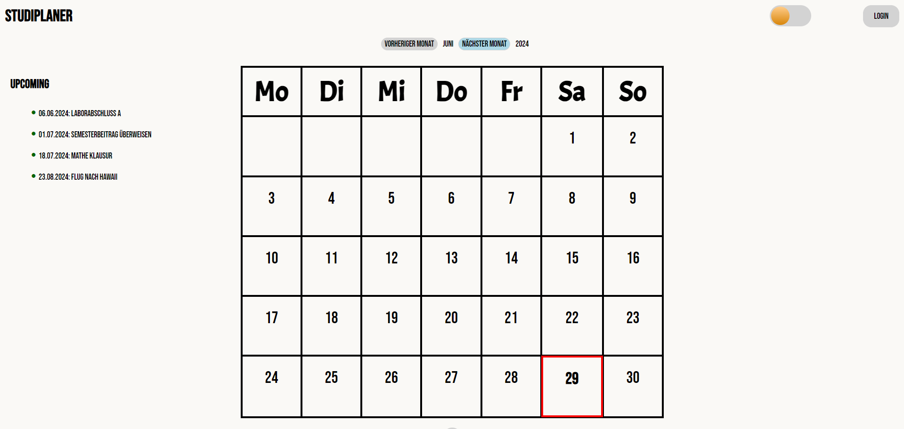
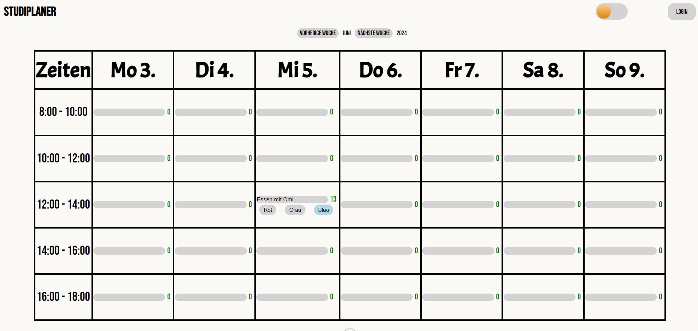
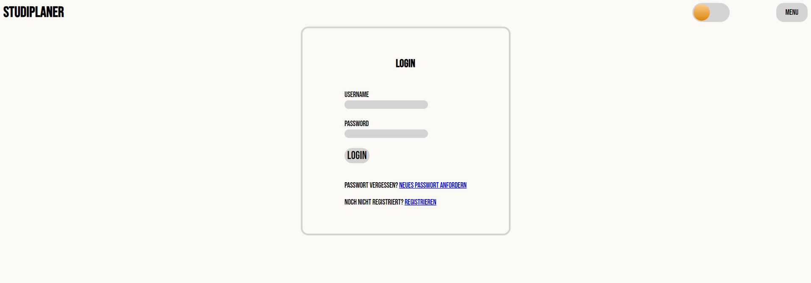

## Studiplaner

Wir haben eine Webseite für Studierende der HAW entwickelt, die es erleichtern soll, ihren 
Studienalltag zu planen und organisieren. Sie umfasst individuelle Konten mit Kalendern zum 
Eintragen von wichtigen Terminen zum Beispiel Abgaben, Klausuren und eigenen Notizen. 
Gegliedert wird diese in eine Monats- und Wochenübersicht. Unser Fokus liegt dabei auf intu
itiver, natürlicher Bedienbarkeit und Design, was eine angenehme Nutzererfahrung gewähr
leisten soll.

## Landing page

## calender view

## login page

## Technologies

Xampp: In unserem Projekt verwenden wir XAMPP, um unsere PHP-basierten Webanwendungen lokal zu erstellen und zu testen.

Mailgun: Wir nutzen Mailgun als externen, kostenlosen Mailserver, um programmatisch dynamisch erstellte Emails versenden zu können, wenn Nutzende ihr Passwort zurücksetzen möchten. 

HTML, CSS und Javascript: HTML, CSS und Javascript sind die drei wichtigsten Sprachen moderner Webentwicklung. 

PHP: Unser Projekt erfordert die Generierung und Bearbeitung dynamischer Inhalte basierend auf Benutzereingaben und Datenbankabfragen. PHP ist ideal für diese Aufgabe, da es serverseitige Bearbeitung von Nutzerdaten ermöglicht.
